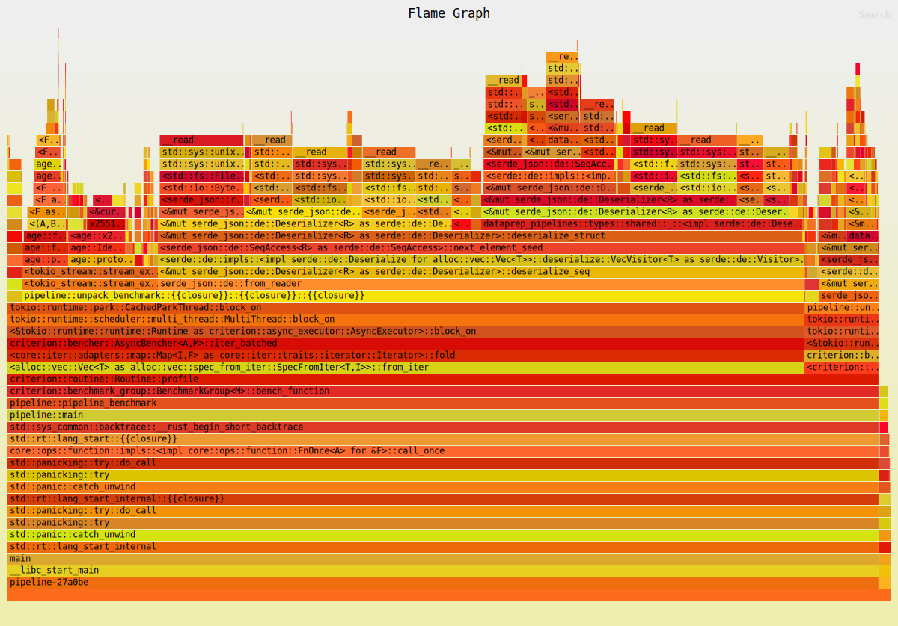

# Dataprep
[](https://codecov.io/gh/banyancomputer/dataprep)
## Dependencies
- cargo
- rustup
- rust +nightly -- either make this the default or use `cargo +nightly <command>` for all commands
- cargo-criterion
- cargo-flamegraph

## Build the binary!
```bash
cargo +nightly build --bin dataprep
```

## Run the binary!
Pack a file:

```bash
dataprep pack --input-dir <INPUT_DIR> --output-dir <OUTPUT_DIR> --manifest-file <MANIFEST_FILE>
```

Unpack a file:

```bash
dataprep unpack --input-dir <INPUT_DIR> --manifest-file <MANIFEST_FILE> --output-dir <OUTPUT_DIR>
```

## Contributing 
Your PRs are welcome! Please make sure to run the following commands before committing:
```bash
cargo +nightly fmt # format code
cargo +nightly clippy # lint code
```
And make sure to sign your commits with `git commit -s`, for example:
```bash
git commit -s -m "Add a new feature"
```

## Test
for unit tests
```bash
cargo +nightly test
```
for integration tests - these test the pipeline end to correctness. Data generated by these tests can 
be found in `dataprep-pipelines/tests`. See `dataprep-pipelines/tests/pipeline.rs` for more details on what 
sort of data is generated and tested against.
```bash
cargo +nightly test pipeline 
```

## Benchmarks
Edit the contents of `env/env.benchmark` to configure the benchmarks. See that file for options and defaults.
To use custom configuration, source the `env/env.benchmark` file before running the benchmarks.

### Naming Conventions
Packing benchmarks are named `Throughput/pack/<input_benchmarked>`.
Unpacking benchmarks are named `Throughput/unpack/<input_benchmarked>`.
Where the name of the benchmark is the name of the file or directory that is being packed/unpacked.
If the file is generated, then the name of the benchmark is the description of the generator i.e. `w2_d2_s1024` for 
a file structure with a width of 2, depth of 2, and a target size of 1024 bytes.

### Benchmarking
Please use Criterion when running benchmarks.
By default, scratch space for generating and packing files is created in a `target/bench` directory
```bash
# If you want to load your own config, you can do so by running
source env/env.benchmark
# Then bench the pipeline
cargo +nightly criterion --bench pipeline
```

You should see results in the `target/criterion/report/index.html` file.

### Profiling with Flamegraph
Dependencies
- Flamegraph
- Perf (linux only)
- Dtrace (mac only)

You can use flamegraph to run profiling when running tests, benchmarks, or whole binaries
Be sure to check out their docs for more info:
https://github.com/flamegraph-rs/flamegraph
Here's an example of how you would run a profiling benchmark on linux:
```bash
# Remember to source your env file if you want to load your own config
cargo +nightly flamegraph --bench pipeline
```

Here's an exmaple of what the flamegraph looks like. I made this using the docker container, so it might not be representative of the performance on your machine.

