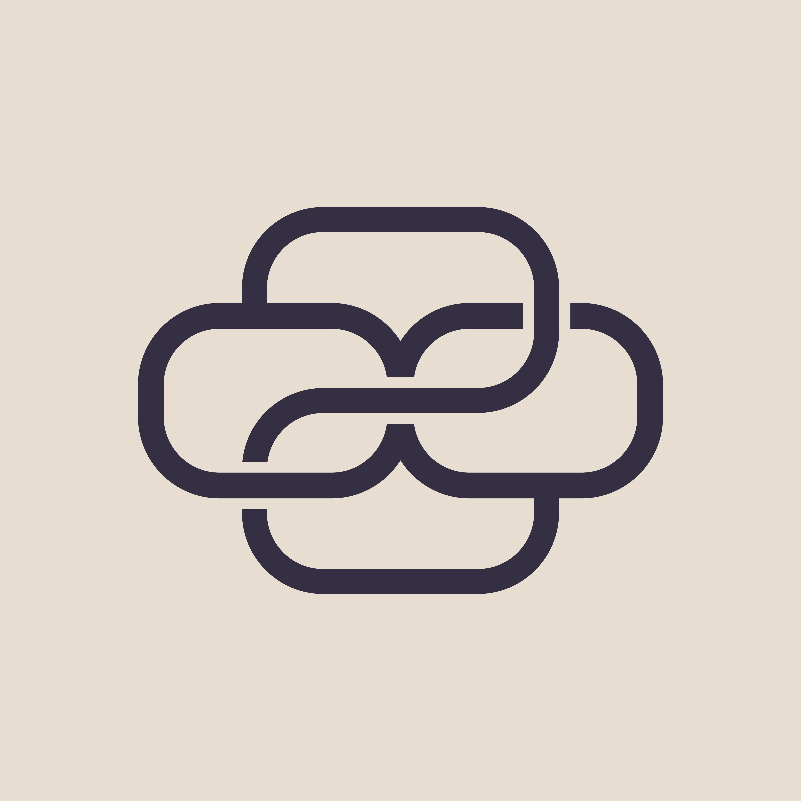

<div align="center">
  <a href="https://github.com/banyancomputer/tomb" target="_blank">
    </img>
  </a>

  <h1 align="center">Tomb</h1>

  <p>
    <a href="https://codecov.io/gh/banyancomputer/tomb">
      
    </a>
    <a href="https://github.com/banyancomputer/tomb/actions?query=">
      
    </a>
    <a href="https://github.com/banyancomputer/tomb/blob/main/LICENSE-MIT">
      
    </a>
    <a href="https://discord.gg/aHaSw9zgwV">
      
    </a>
  </p>
</div>

<div align="center"><sub>:warning: Work in progress :warning:</sub></div>

##

## Outline

- [](#)
- [Outline](#outline)
- [What is Tomb?](#what-is-tomb)
- [Installation](#installation)
  - [Using `cargo`](#using-cargo)
- [Usage](#usage)
- [Testing the Project](#testing-the-project)
- [Benchmarking the Project](#benchmarking-the-project)
  - [Configuring the benchmarks](#configuring-the-benchmarks)
  - [Running the benchmarks](#running-the-benchmarks)
  - [Profiling the binary](#profiling-the-binary)
- [Contributing](#contributing)
  - [Formatting](#formatting)
  - [Pre-commit Hook](#pre-commit-hook)
  - [Recommended Development Flow](#recommended-development-flow)
  - [Conventional Commits](#conventional-commits)
- [Getting Help](#getting-help)
- [External Resources](#external-resources)
- [License](#license)


## What is Tomb?
Tomb is a tool for indexing, compressing, chunking, and encrypting / decrypting large files and directories into manageable and portable CAR files of blocks that don't leak information about the original filesystem, plus a reconstruction manifest.

It takes in a path, and emits a directory full of CAR files for upload to Filecoin (or streams blocks directly to a network endpoint like IPFS). It also emits a manifest describing how to reconstruct the original filesystem that does recordkeeping about versions and diffs, so you can have a git-like workflow for change management on your filesystem backups.

The CAR files can be uploaded to Filecoin, and the metadata files can be uploaded to Banyan's webapp through this program, so you can share and manage your files from any device. Banyan handles all of this for its customers.

This repository uses [WNFS](https://github.com/wnfs-wg/rs-wnfs) to get awesome features like granular and feature-packed cryptographic permissioning and file version control.

This repository cross-compiles to WASM so you can access filesystems packed by Tomb in the browser. This functionality is still under development.

It is meant to be used as a tool for preparing extremely large quantities of academic and enterprise data for manageable archival storage on decentralized storage networks such as Filecoin. 

It's meant to run anywhere, and our intent is that this code never be the bottleneck of an ingestion pipeline.

## Installation

### Using `cargo`

To install our CLI tool using `cargo`, run:
```console
cargo install --path tomb
```

[//]: # (TODO: Add more installation instructions here as we add more ways to install the project.)

## Usage
Tomb is easy to use. To encrypt a directory, run:
```console
tomb pack --input-dir <INPUT_DIR> --output-dir <PACKED_DIR> --manifest-file <MANIFEST_FILE>
```
Where `<INPUT_DIR>` is the directory you want to encrypt, `<PACKED_DIR>` is the directory you want to store the encrypted files in, and `<MANIFEST_FILE>` is the file you want to store the manifest in.
The manifest file is a JSON file that contains the metadata for the encrypted files, including the file names, keys, and how to inflate the packed files back to the original files.

To decrypt the same directory, run:
```console
tomb unpack --input-dir <PACKED_DIR> --output-dir <UNPACKED_DIR> --manifest-file <MANIFEST_FILE>
```

`<UNPACKED_DIR>` will contain the original files from `<INPUT_DIR>` once the process is complete.

## Testing the Project

- Run tests

  ```console
  cargo test
  ```
  This should run all the tests in the workspace.

## Benchmarking the Project

For benchmarking and measuring performance, this project leverages
[criterion][criterion] and a tool called [fake-file][fake-file]. So far these benchmarks
are very simple and only measure the performance of the whole encryption and decryption pipeline.
As such, they alone are not helpful for identifying performance bottlenecks, but can offer the developer a
good baseline for measuring the performance of the project on there local machine.

### Configuring the benchmarks
The one benchmark in this workspace can be configured by editing and sourcing `env/env.benchmark`. See this file
for more information on how to best configure the benchmarks, as well as info on default values.

### Running the benchmarks
- Run benchmarks

  ```console
  cargo bench
  ```

### Profiling the binary 
At the moment, profiling is not built into the benchmarks. However, we do support and recommend using the `flamegraph` crate
for profiling the binary.
It is unclear whether this provides accurate readings with our Async code, but it is a good starting point for profiling.
Use this if you are trying to figure out where bottlenecks exist in `tomb-lib`.

Example of profiling the benchmarks:
```console
cargo install flamegraph
cargo install --path tomb
cargo flamegraph -- tomb ...
```
You may have to run `flamegraph` as `sudo`.

See the [flamegraph crate][flamegraph] Github page for more information on how to use this tool,
and resources on interpreting the results.

[//]: # (TODO: Implement Docker for this project.)
[//]: # (## Running tomb on Docker)

[//]: # ()
[//]: # (We recommend setting your [Docker Engine][docker-engine] configuration)

[//]: # (with `experimental` and `buildkit` set to `true`, for example:)

[//]: # ()
[//]: # (``` json)

[//]: # ({)

[//]: # (  "builder": {)

[//]: # (    "gc": {)

[//]: # (      "defaultKeepStorage": "20GB",)

[//]: # (      "enabled": true)

[//]: # (    })

[//]: # (  },)

[//]: # (  "experimental": true,)

[//]: # (  "features": {)

[//]: # (    "buildkit": true)

[//]: # (  })

[//]: # (})

[//]: # (```)

[//]: # ()
[//]: # (- Build a multi-plaform Docker image via [buildx][buildx]:)

[//]: # ()
[//]: # (  ```console)

[//]: # (  docker buildx build --platform=linux/amd64,linux/arm64 -t tomb --progress=plain .)

[//]: # (  ```)

[//]: # ()
[//]: # (- Run a Docker image &#40;depending on your platform&#41;:)

[//]: # ()
[//]: # (  ```console)

[//]: # (  docker run --platform=linux/amd64 -t tomb)

[//]: # (  ```)

## Contributing

:balloon: We're thankful for any feedback and help in improving our project!
We have a [contributing guide](./CONTRIBUTING.md) to help you get involved. We
also adhere to our [Code of Conduct](./CODE_OF_CONDUCT.md).

[//]: # (TODO: Implement a Nix flake for this project.)
[//]: # (_### Nix)

[//]: # ()
[//]: # (This repository contains a [Nix flake][nix-flake] that initiates both the Rust)

[//]: # (toolchain set in [rust-toolchain.toml]&#40;./rust-toolchain.toml&#41; and a)

[//]: # ([pre-commit hook]&#40;#pre-commit-hook&#41;. It also installs helpful cargo binaries for)

[//]: # (development. Please install [nix][nix] and [direnv][direnv] to get started.)

[//]: # ()
[//]: # (Run `nix develop` or `direnv allow` to load the `devShell` flake output,)

[//]: # (according to your preference._)

### Formatting

For formatting Rust in particular, please use `cargo fmt` as it uses
specific nightly features we recommend by default.

### Pre-commit Hook

This project recommends using [pre-commit][pre-commit] for running pre-commit

hooks. Please run this before every commit and/or push.

- Install pre-commit on this project

  ```console
  pre-commit install
  ```

- If you are doing interim commits locally, and for some reason if you _don't_

  want pre-commit hooks to fire, you can run

  `git commit -a -m "Your message here" --no-verify`.

### Recommended Development Flow

- We recommend leveraging [cargo-watch][cargo-watch],
  [cargo-expand][cargo-expand] and [irust][irust] for Rust development.
- We recommend using [cargo-udeps][cargo-udeps] for
- emoving unused dependencies
  before commits and pull-requests.

### Conventional Commits

This project *lightly* follows the [Conventional Commits
convention][commit-spec-site] to help explain
commit history and tie in with our release process. The full specification
can be found [here][commit-spec]. We recommend prefixing your commits with
a type of `fix`, `feat`, `docs`, `ci`, `refactor`, etc..., structured like so:

```
<type>[optional scope]: <description>

[optional body]

[optional footer(s)]
```

## Getting Help

For usage questions, usecases, or issues reach out to us in our [Discord channel](https://discord.gg/aHaSw9zgwV).

We would be happy to try to answer your question or try opening a new issue on Github.

## External Resources

These are references to specifications, talks and presentations, etc.

## License

[buildx]: https://github.com/docker/buildx
[cargo-expand]: https://github.com/dtolnay/cargo-expand
[cargo-udeps]: https://github.com/est31/cargo-udeps
[cargo-watch]: https://github.com/watchexec/cargo-watch
[commit-spec]: https://www.conventionalcommits.org/en/v1.0.0/#specification
[commit-spec-site]: https://www.conventionalcommits.org/
[criterion]: https://github.com/bheisler/criterion.rs
[fake-file]: https://crates.io/crates/fake-file
[docker-engine]: https://docs.docker.com/engine/
[direnv]:https://direnv.net/
[irust]: https://github.com/sigmaSd/IRust
[nix]:https://nixos.org/download.html
[nix-flake]: https://nixos.wiki/wiki/Flakes
[pre-commit]: https://pre-commit.com/
[proptest]: https://github.com/proptest-rs/proptest
[strategies]: https://docs.rs/proptest/latest/proptest/strategy/trait.Strategy.html
[flamegraph]: https://github.com/flamegraph-rs/flamegraph
